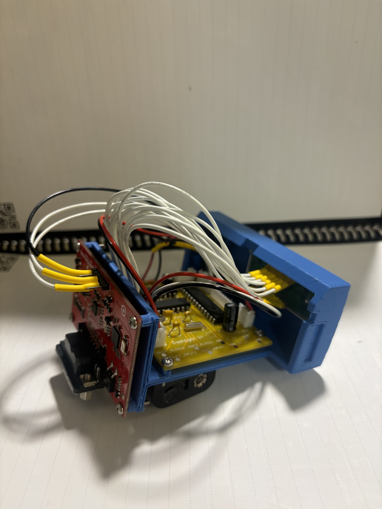
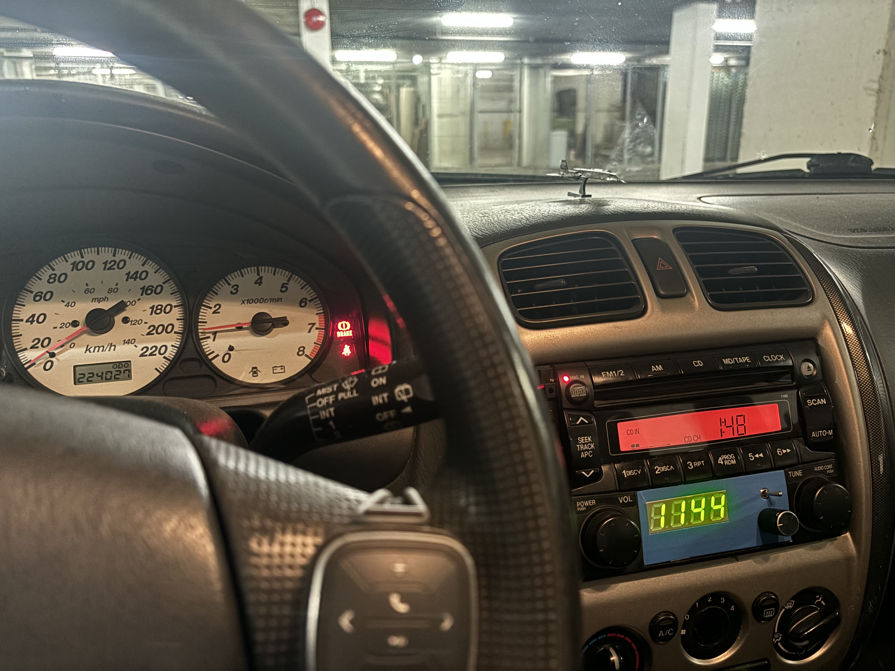
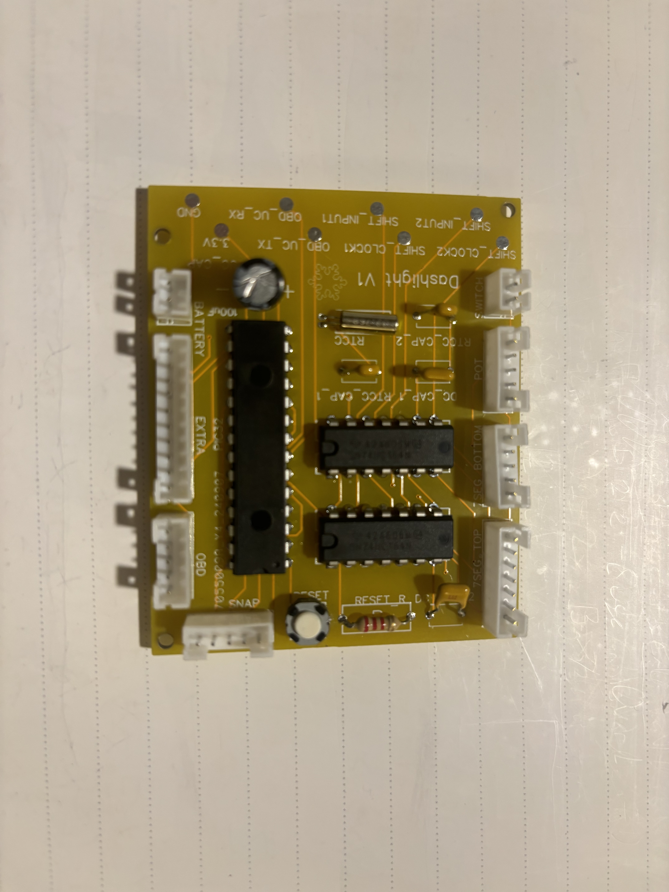
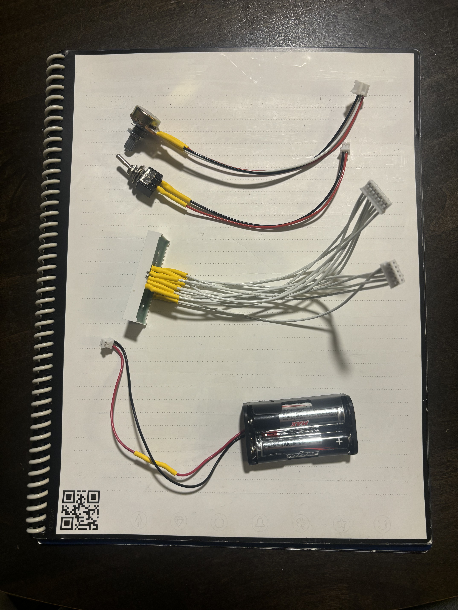
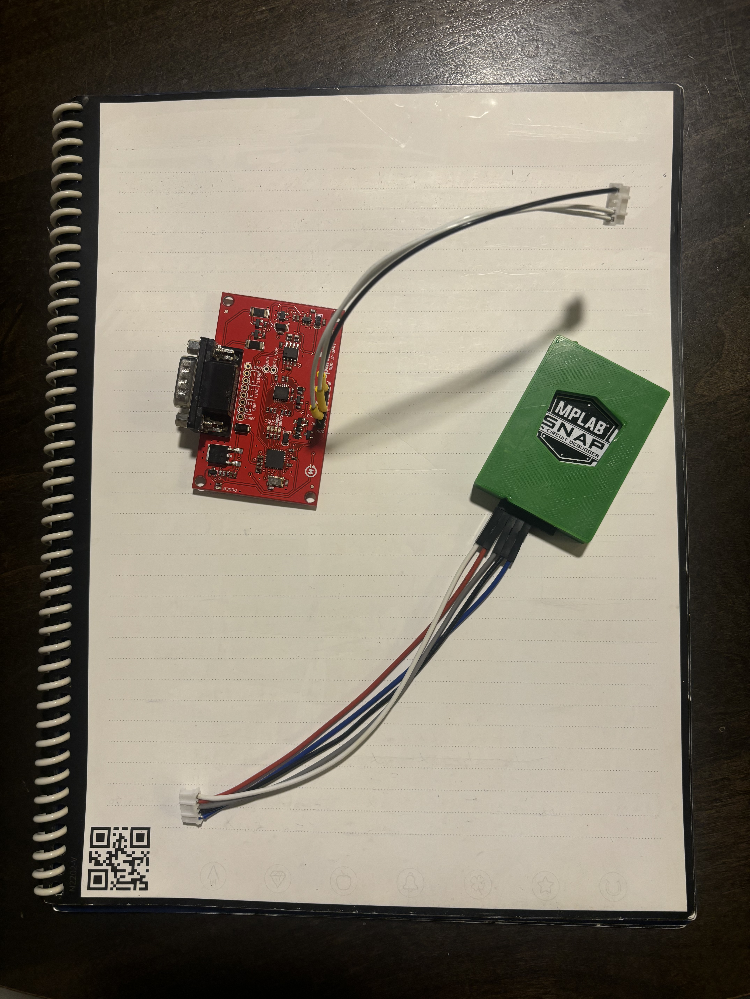
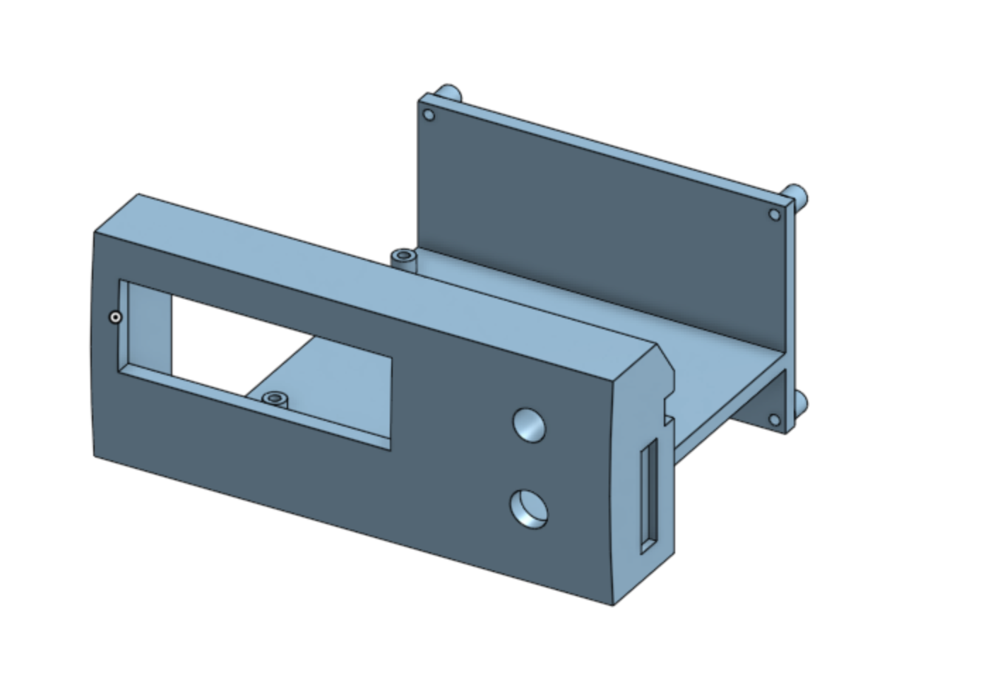

# PCB Design for Dashlight Project

This repository includes files used in the design and build of hardware for the Dashlight project. Find information about the software side of the project at https://github.com/DuncanB6/dashlight-firmware.

## Overview

The objective of this project is to provide a display for my car (The Yellow Peril) that displays some data while driving. 

The core to this project is a main PCB which houses a PIC32 microcontroller and the hardware necessary for interface with a 7 segment LED as well as several peripherals. Also includes a RTCC for timekeeping. It's a simple 2 layer PCB equiped with test points, PH connectors, and supporting components for the microcontroller. All components are through hole for easy assemble and to enable breadboard debugging.

This PCB has two versions. Version 1 was unusable because of incorrect component sizes. Version 2 is currently in use.

The PCB and all components are mounted to a 3D printed rack, which is inserted into the empty CD changer slot in my car.

## Prototyping

To develop this device, a prototype was constructed using a breadboard. The components are nearly identical to the finished PCB design. See the BoM for information on parts.

## Main Board

This design uses a PIC32 MX130F064B-I/SP microcontroller. It uses a 32.768kHz oscillator for its RTCC (Real Time Clock and Calendar). It uses two SN74HC164N shift registers to control the 7 segment display. PH connectors are used to connect the main PCB to some of the peripherals. A reset button is present to reset the PIC32.

Test points are available for the UART communication with the OBD2 to UART peripheral, the inputs to the shift registers, and the power supply.

## Peripherals

Peripherals connect to the main board using one or more PH style connectors. This is to allow for greater modularity. Peripherals include:
- 7 segment display: Displays all data
- Switch: On-off switch
- Potentiometer: Allows user to switch between software modes
- Battery: Power supply
- OBD2 to UART board: Translates data from the OBD2 port to UART
- MPLAB Snap: For debugging and flashing

Additionally, some unused pins are available on a 10 pin PH connector for use with future peripherals.

## Design Files

EasyEDA was used for design. The schematic files are available in this repository, as well as the most recent Gerber file for fabrication. See BoM for components used with this PCB, some parts may differ slightly from PCB design.

## Rack

The rack is printed in PLA using a Prusa MKS+. It went through a series of iterations that aimed to fit the hardware in a limited space and fit parts accurately. STL and STEP files are available here.

